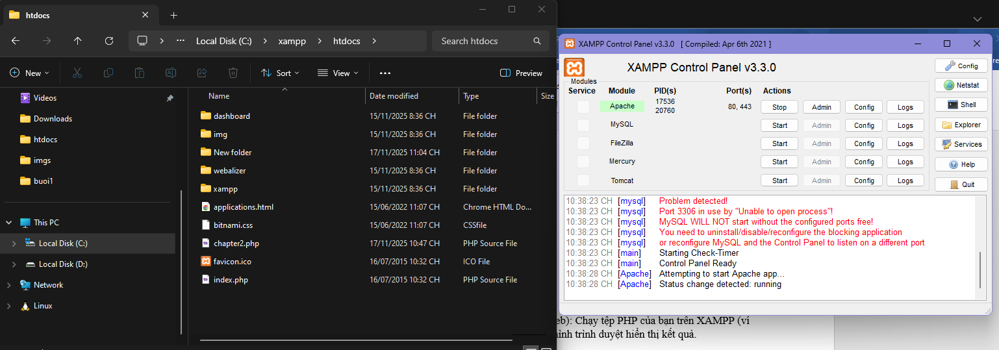

A.	Code đã hoàn thiện: Dán (paste) toàn bộ code của tệp chapter2.php mà bạn đã hoàn thiện. 
<!DOCTYPE html> 
<html lang="vi"> 
<head> 
    <meta charset="UTF-8"> 
    <title>PHT Chương 2 - PHP Căn Bản</title> 
</head> 
<body> 
    <h1>Kết quả PHP Căn Bản</h1> 
     
    <?php 
 
    $ho_ten = "Cao Thái Tuấn"; 
    $diem_tb = 9; 
    $co_di_hoc_chuyen_can = true; 
 
    echo "Họ tên: $ho_ten  "; 
    echo "Điểm trung bình: $diem_tb  "; 
 
    if ($diem_tb >= 8.5 && $co_di_hoc_chuyen_can == true) {
        echo "Xếp loại: Giỏi  ";
    } 
    elseif ($diem_tb >= 6.5 && $co_di_hoc_chuyen_can == true) {
        echo "Xếp loại: Khá  ";
    } 
    elseif ($diem_tb >= 5.0 && $co_di_hoc_chuyen_can == true) {
        echo "Xếp loại: Trung bình  ";
    } 
    else {
        echo "Xếp loại: Yếu (Cần cố gắng thêm!)  ";
    }
 
    function chaoMung() {
        echo "Chúc mừng bạn đã hoàn thành PHT Chương 2!  ";
    }
 
    chaoMung();
 
    ?> 
 
</body> 
</html>

Câu hỏi của tôi là: PHP là ngôn ngữ kịch bản chạy theo từng request, trong khi Java biên dịch và chạy thường trực. Vậy tại sao PHP vẫn cần OOP và việc sử dụng Class/Object trong PHP khác gì so với Java về mặt quản lý bộ nhớ và vòng đời đối tượng?