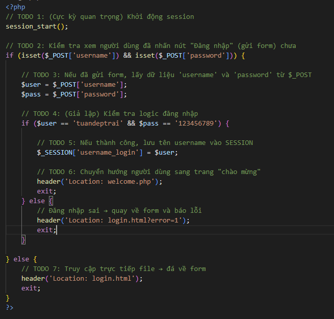
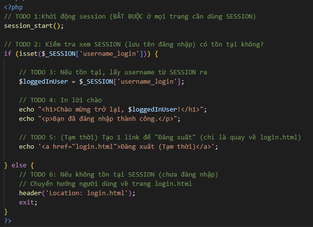
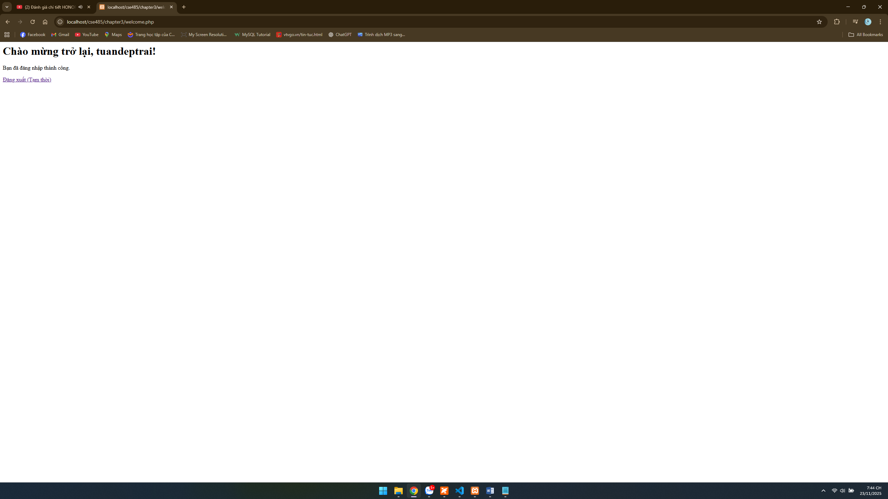

A.	Code đã hoàn thiện: Dán (paste) toàn bộ code của 2 tệp bạn đã sửa: 
•	handle_login.php 
<?php
session_start();

if (isset($_POST['username']) && isset($_POST['password'])) {

    $user = $_POST['username'];
    $pass = $_POST['password'];

    if ($user == 'tuandeptrai' && $pass == '123456789') {

        $_SESSION['username_login'] = $user;

        header('Location: welcome.php');
        exit;
    } else {
   
        header('Location: login.html?error=1');
        exit;
    }

} else {

    header('Location: login.html');
    exit;
}
?>

•	welcome.php 
<?php

session_start();

if (isset($_SESSION['username_login'])) {

    $loggedInUser = $_SESSION['username_login'];

    echo "<h1>Chào mừng trở lại, $loggedInUser!</h1>";
    echo "
Bạn đã đăng nhập thành công.
";

    echo '<a href="login.html">Đăng xuất (Tạm thời)</a>';

} else {
    header('Location: login.html');
    exit;
}
?>

B.	Ảnh chụp màn hình Kết quả (Trình duyệt Web): Chụp 01 ảnh màn hình trình duyệt hiển thị trang welcome.php sau khi bạn đăng nhập thành công (phải thấy rõ dòng chữ "Chào mừng trở lại, admin!"). 

Câu hỏi của tôi là: Nếu không gọi session_start() ở đầu file webcome.php, điều gì sẽ xảy ra và tại sao PHP không tự động mở lại session?