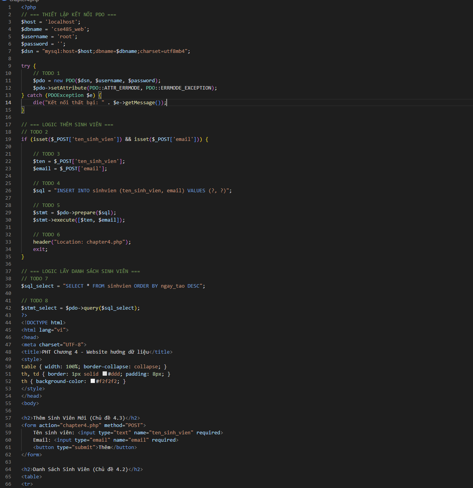
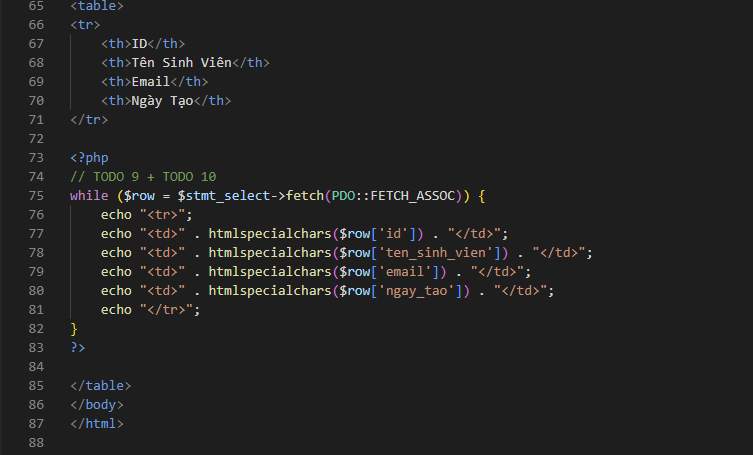
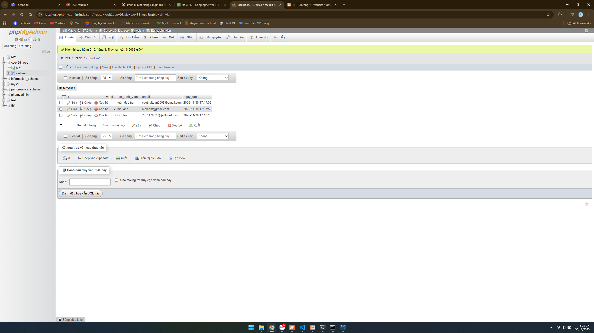

ảnh code minh họa

1. Ảnh 1 (phpMyAdmin): Chụp màn hình tab "Browse" (Duyệt) của bảng sinhvien trong
phpMyAdmin, cho thấy bạn đã INSERT thành công ít nhất 2-3 sinh viên.

2. Ảnh 2 (Trình duyệt Web): Chụp ảnh màn hình trang chapter4.php của bạn, hiển thị
đúng 2-3 sinh viên mà bạn vừa thêm (chứng minh SELECT thành công)

